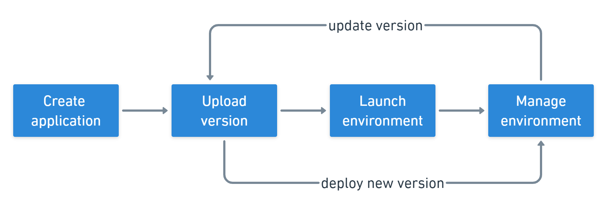

# Elastic Beanstalk

## Developer problems on aws

- Managing infrastructure
- Deploying Code
- Configuring all the databases, load balancers, etc
- Scaling concerns
- Most web apps have the same architecture (Application Load Balancer + Auto Scaling Group)
- All the developers want is for their code to run!
- Possibly consistently across different applications and environments

## Overview
- Elastiic Beanstalk is a developer centric view of deploying an application on AWS.
- Managed service to provision EC2, ASG, ELB, RDS...
  - Automatically handles capacity provisioning, load balancing, scalling, application health, monitoring, instance configuration.
  - Just the application code is the responsibility of the developer.
- We still have full control over the configuration.
- Beanstalk is free but you pay for the underlying instances.

## Components
- **Application**: collection of Elastic Beanstalk components (environments, versions, configurations and etc...)
- **Application Version**: an iteration of your application code
- **Environment**
  - Collection of AWS resources an application version (only one application version at time)
  - **Tiers**: Web Server Environment & Worker Environment Tier
  - You can create multiple environments (dev, test, prod, whatever you want called)

